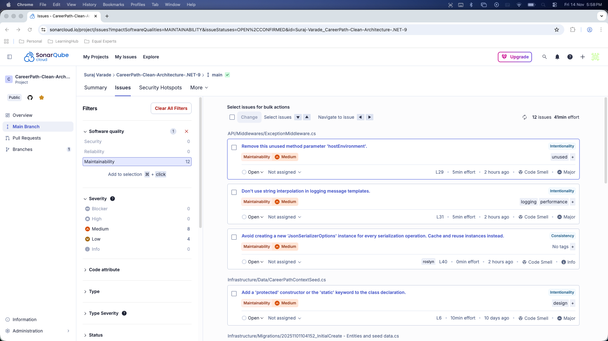
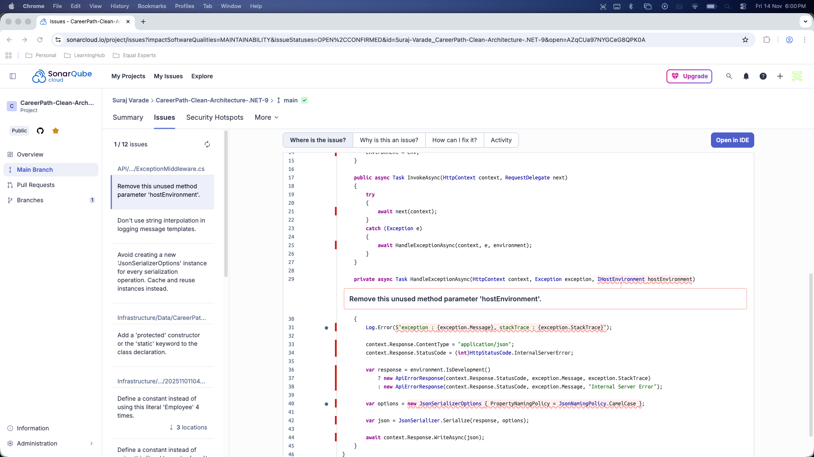
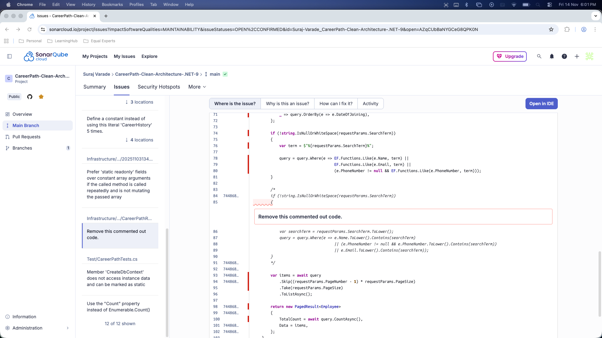

# Career Path
A modular, Clean Architecture–based .NET application designed to track and manage employee career progression, including roles, reporting hierarchy, and career history within an organization.

## Project overview
CareerPath is an ASP.NET Core Web API (targeting .NET 9) using:
* Clean, layered structure: ```API, Core, Infrastructure```
* EF Core (SqlServer) for persistence
* Repository pattern
* Serilog for logging (console + file)
* Seed data for quick demo
* Unit tests (xUnit), Coverlet for coverage.
* SonarQube Integration (via SonarCloud)

This repo includes a ready GitHub Actions workflow to build/publish the API and SonarQube integration (SonarCloud).

## Tech Stack
- **Language:** C#
- **Backend (API):** ASP.NET Core Web API (.NET 9), Entity Framework Core (Code-First + Migrations), Serilog for logging
- **Database:** Azure SQL Database, EF Core Migrations
- **DevOps / CI-CD:** Github actions for build, test and deploy, automated build -> publish -> deploy pipelines, secrets management via Github Environments.
- **Testing:** xUnit for unit testing, In-Memery EF Core for repository testing.
- **Architecture:** Clean architecture, Interface-driven design, dependency injection, EntityFramework Core, in-memory store (test)
- **Code Quality & Security:** SonarQube (via SonarCloud)

## Project Structure
```text
CareerPath/
│
├── API/                                            # ASP.NET Core Web API project (entrypoint)
│   └── Extensions/
│   |   └── ApplicationServiceExtensions.cs
│   |   └── DateExtensions.cs
|   |   └── LoggingExtensions.cs
|   └── DTOs/
│   |   └── CareerHistoryDto.cs
│   |   └── CreateEmployeeDto.cs
│   |   └── EmployeeDto.cs
│   |   └── RoleDto.cs
│   └── Errors/
│   |   └── ApiErrorResponse.cs
│   └── logs/
│   └── Middlewares
│   |   └── ExceptionMiddleware.cs
│   └── API.http                                    # list of all api endpoints to test.
│   └── appsettings.json
│   └── appsettings.Development.json
│   └── Program.cs
│
├── Core/                                           # Domain entities, interfaces, request helpers (PagedResult, RequestParams)
│   └── Entities/
│   |   └── BaseEntity.cs
│   |   └── CareerHistory.cs
│   |   └── Employee.cs
│   |   └── Role.cs
│   └── Interfaces/
│   |   └── ICareerPathRepository.cs
│   └── RequestHelpers/
│   |   └── PagedResult.cs
│   |   └── RequestParams.cs
|
├── Infrastructure/                                 # EF Core DbContext, Repositories, Migrations, Seed data
│   └── Data/
│   |   └── SeedData/
|   |   |   └── CareerHistory.json
|   |   |   └── Employees.json
|   |   |   └── Roles.json
│   |   └── CareerPathContextSeed.cs
│   |   └── CareerPathDbContext.cs
│   └── Migrations/                                 # EF Migrations (committed)
│   └── Repositories/
│   |   └── CareerPathRepository.cs
|
├── Test/                                           # xUnit tests (Test.csproj)
│   └── TestResults/
│   └── CareerPathTests.cs                          # Repository tests
│   └── AddCoverlet_README.txt                    
│
├─ .github/workflows/                               # CI/CD workflows (build & deploy)
│   └── main.yml
│   └── sonarqube-build.yml
├─ CareerPath.sln
└─ README.md
|
```
## Local setup & run
**Prerequisites**
* .NET SDK 9.x installed
* SQL Server locally / Azure SQL connection string for production testing

**1. Clone the repo**
```bash
git clone https://github.com/Suraj-Varade/CareerPath-Clean-Architecture-.NET-9.git

cd CareerPath
```
- Use appsettings.Development.json for local development (do NOT commit secrets).
- Alternatively, you can also use ```dotnet user-secrets``` for local secrets
```text
"ConnectionStrings": {
    "DefaultConnection": "{yourDbConnectionString}"
  },
```

**2. Restore, build and run**
```bash
# from repo root
dotnet restore CareerPath.sln

# build only the API project
dotnet build /API/API.csproj -c Release

# (Optional) If you want to run tests
dotnet test

# publish (local verification)
dotnet publish /API/API.csproj -c Release -o ./publish_output

# run the published app
cd publish_output

dotnet API.dll

# or from project
dotnet run --project /API/API.csproj -c Release
```

After the app starts, test:
http://localhost:5078/api/employees

**Ef migrations:**
* dotnet-ef tool if you manage migrations locally:
```bash
dotnet tool install --global dotnet-ef
```

## Entity Framework, Migrations & Seeding
**Key points**
* Migrations are committed under Infrastructure/Migrations/ (so CI/CD & runtime can apply them).
* On startup the app applies migrations only via context.Database.MigrateAsync() and then runs seeding (CareerPathContextSeed.SeedAsync(context)).

**Important**: Do **not** call EnsureCreated() in production when you plan to use migrations — EnsureCreated() and Migrate() conflict and can cause errors like "There is already an object named 'Employees' in the database."

**Local migration workflow**
If you want to create/update migrations locally:

* Add a migration (project containing DbContext is Infrastructure)
```bash
dotnet ef migrations add InitialCreate -p Infrastructure/Infrastructure.csproj -s API/API.csproj
```

* Apply locally (if connection string points to your local DB)
```bash
dotnet ef database update -p Infrastructure/Infrastructure.csproj -s API/API.csproj
```

**Tests & Code Coverage**
* Tests are in Test/ (xUnit).
* **Important CI note**: Do not publish test artifacts to production deployment output. Publish only the API project output.
* Coverlet (code coverage) may be present; avoid instrumenting builds that produce the final publish artifact to be deployed. In CI, run tests in a separate step and don't copy bin/Debug test outputs to artifact folder.

Example test command (CI):
```
- name: Run tests
  run: dotnet test CareerPath.sln --configuration Release
```

**Code Review and Security**
* SonarQube (via SonarCloud).

## 🚀 API Endpoints
The API follows a RESTful approach for managing employee and role data. The base path is /api.

### Employees
1. GET
    - ```/api/employees```	
    - Retrieves a paginated list of all employees with their full career history. Supports filtering, searching, and sorting.

2. GET	
   - ```/api/employees/{id}```
   - Retrieves a single employee by ID with their full career history.

3. POST
    - ```/api/employees```
    - Creates a new employee record. (excluding CareerHistory,Roles)

### Sample request and response
```GET  /api/employees```
* Description: Get a paginated list of employees.
* Query Parameters:
    * ```pageNumber```: The page number.
    * ```pageSize```: The number of items per page.
    * ```searchTerm```: (string) Filter by employee Name, Email, or PhoneNumber.
    * ```isActive```: (boolean string, e.g., "true", "false") Filter by Active or Inactive status.
    * ```orderBy```: (string) Sort by joiningDateDesc (most recent first) or default (oldest first).
* Sample Request (API.http format)
```
GET http://localhost:5078/api/employees?pageNumber=1&pageSize=2&isActive=true&searchTerm=john&orderBy=joiningDateDesc
Accept: application/json
```
* Sample Response (Success : 200 - OK)
```json
{
  "totalCount": 1,
  "data": [
    {
      "name": "John Doe",
      "address": "123 Main Street, New York, NY",
      "phoneNumber": "+1-212-555-7890",
      "email": "john.doe@example.com",
      "status": "Active",
      "dateOfJoining": "2018-03-15",
      "dateOfExit": null,
      "tenureInYears": 7,
      "careerDetails": [
        {
          "role": {
            "title": "Software Engineer II",
            "level": "Mid"
          },
          "managerName": "Michael Brown",
          "department": "Software Development",
          "salary": "¤75,000.00",
          "startDate": "2020-03-16",
          "endDate": null,
          "notes": "Promoted to Mid-level Engineer handling API integrations.",
          "durationInMonths": 69
        },
        {
          "role": {
            "title": "Software Engineer I",
            "level": "Junior"
          },
          "managerName": "Michael Brown",
          "department": "Software Development",
          "salary": "¤55,000.00",
          "startDate": "2018-03-15",
          "endDate": "2020-03-15",
          "notes": "Started as Junior Engineer under Michael Brown.",
          "durationInMonths": 24
        }
      ]
    }
  ]
}
```
### API/API.http (listed endpoints)
```
@API_HostAddress = http://localhost:5078

### Get Employees
GET {{API_HostAddress}}/api/employees?pageNumber=1&pageSize=50
Accept: application/json


### Get Employee by Id
GET {{API_HostAddress}}/api/employees/14
Accept: application/json


### Get Employee with invalid Id
GET {{API_HostAddress}}/api/employees/10500 
Accept: application/json


### Get Employee by SearchTerm
GET {{API_HostAddress}}/api/employees?pageNumber=1&pageSize=5&SearchTerm=John
Accept: application/json


### Get Employees (OrderBy joiningdatedesc)
GET {{API_HostAddress}}/api/employees?pageNumber=1&pageSize=5&OrderBy=joiningdatedesc
Accept: application/json


### Get Roles
GET {{API_HostAddress}}/api/roles
Accept: application/json


### Add Employee
POST {{API_HostAddress}}/api/employees
Content-Type: application/json

{
  "Name": "Kent Bohr",
  "Address" : "st.345 apartment no.4, east block, kent circle, LA",
  "PhoneNumber": "23242324975",
  "Email": "kent@example.com",
  "Status": "Active"
}


### Get Employee
GET {{API_HostAddress}}/api/employees?pageNumber=1&pageSize=2&isActive=true&searchTerm=john&orderBy=joiningDateDesc
Accept: application/json
```

## 💾 EF Core Data Modeling: Employee/Manager Self-Join
This project uses Entity Framework Core (EF Core) to manage the database schema. A key aspect of the domain is defining the reporting hierarchy, which is handled using a self-join relationship modeled through the CareerHistory entity.

### How the Relationship Works
The self-join is established between two instances of the ```Employee``` entity: one acts as the **Employee**, 
and the other acts as the **Manager**. This relationship is mediated by the ```CareerHistory``` table.

The ```CareerHistory``` entity has three foreign keys pointing to other tables:
1. ```EmployeeId```: Points to the ```Employee``` (the person whose career path is being recorded).
2. ```RoleId```: Points to the ```Role```.
3. ```ManagerId```: Points to the ```Employee``` (the person managing the employee for that specific period).

1. The ```CareerHistory``` Entity
   The ```CareerHistory``` entity defines the foreign key (```ManagerId```) and the navigation property (```Manager```) for the self-join:

```C#
public class CareerHistory : BaseEntity
{
    // ... other properties ...
    
    public int? ManagerId { get; set; } // Foreign Key: Reference to Employee/Manager

    // Navigation Property
    [JsonIgnore]
    public Employee? Manager { get; set; } // The Manager (Self-join target)
    
    // ... other properties ...
}
```

2. The ```Employee``` Entity (Defining the Inverse) 🔄
To complete the self-join, the ```Employee``` entity must define two inverse collections, 
telling EF Core which records in ```CareerHistory``` belong to the **employee** as the employee 
and which belong to them as the **manager**.

```C#
public class Employee : BaseEntity
{
    // ...
    // Collection 1: Records where this Employee is the primary employee
    public ICollection<CareerHistory> EmployeeCareerHistories { get; set; } = new List<CareerHistory>();

    // Collection 2: Records where this Employee is acting as a Manager
    public ICollection<CareerHistory> ManagerCareerHistories { get; set; } = new List<CareerHistory>();
}
```
This configuration explicitly tells EF Core to manage the one-to-many relationship 
(```Employee``` to ```CareerHistory```) using two separate pathways:
* The relationship between ```Employee.EmployeeCareerHistories``` and ```CareerHistory.EmployeeId```.
* The relationship between ```Employee.ManagerCareerHistories``` and ```CareerHistory.ManagerId```.

### Eager Loading in the Repository
When retrieving an employee, the CareerPathRepository must use Eager Loading (.Include() and .ThenInclude()) to pull in all related career data, including the manager's name, in a single database query.
This is demonstrated in the ```GetEmployeesAsync``` method:

```C#
// Infrastructure/Repositories/CareerPathRepository.cs

public async Task<PagedResult<Employee>> GetEmployeesAsync(RequestParams? requestParams)
{
    var query = context.Employees
    .AsNoTracking()
    .Include(e => e.EmployeeCareerHistories)
    .ThenInclude(ch => ch.Role)
    .Include(e => e.EmployeeCareerHistories)
    .ThenInclude(ch => ch.Manager) // Crucial line for loading the Manager details
    .AsQueryable();

    // ... filtering and pagination logic ...
}
```
By including ```ch.Manager```, the repository pulls the related Employee record (the manager) for every career history entry, 
ensuring the API has the data needed to display the manager's name (```ch.Manager.Name```) in the final DTO

## 🛡️ Code Quality & Security (SonarQube Integration)
Code quality and security analysis is enforced using SonarQube (via SonarCloud), which is integrated directly into the GitHub Actions CI/CD pipeline. Every push to the main branch and every Pull Request triggers a comprehensive analysis.

### Configuration
* Tool: SonarScanner for .NET (executed via ```dotnet-sonarscanner```).
* Analysis Service: **SonarCloud**.
* Token: The analysis requires a secure token, stored as a GitHub Secret named ```SONAR_TOKEN```.
* GitHub Actions Workflow (```.github/workflows/sonarqube-build.yml```)





## GitHub Actions CI/CD (recommended pipeline)
High-level flow:
1. Checkout
2. Setup .NET (DOTNET_VERSION: '9.0.x')
3. Restore dependencies (solution)
4. Build API project
5. Run tests (optional; ensure tests succeed before publish)
6. Clean publish folder
7. Publish API project to publish_output

## Useful commands (summary)
Build & publish API:
```
dotnet restore CareerPath.sln
dotnet build /API/API.csproj -c Release
dotnet publish /API/API.csproj -c Release -o ./publish_output
```

Add migration (local dev):
```
dotnet ef migrations add YourMigrationName -p Infrastructure/Infrastructure.csproj -s API/API.csproj
```

Apply migrations to DB:
```
# uses connection string from appsettings or environment
dotnet ef database update -p Infrastructure/Infrastructure.csproj -s API/API.csproj
```

## Where to look in the repo
* ```API/Program.cs``` — app setup, logging, migrations, api endpoints and their configurations.
* ```Infrastructure/Migrations/``` — migration files.
* ```.github/workflows/sonarqube-build.yml``` — sonarQube definations.
* ```.github/workflows/``` — CI/CD definitions (edit to implement infra deploy step).

## Final recommended additions
* Add README.md (this file) to root.
* Add a small deploy-infra.yml workflow:
    * login with service principal,
    * run the Bicep deployment,
    * then deploy the published artifact.
